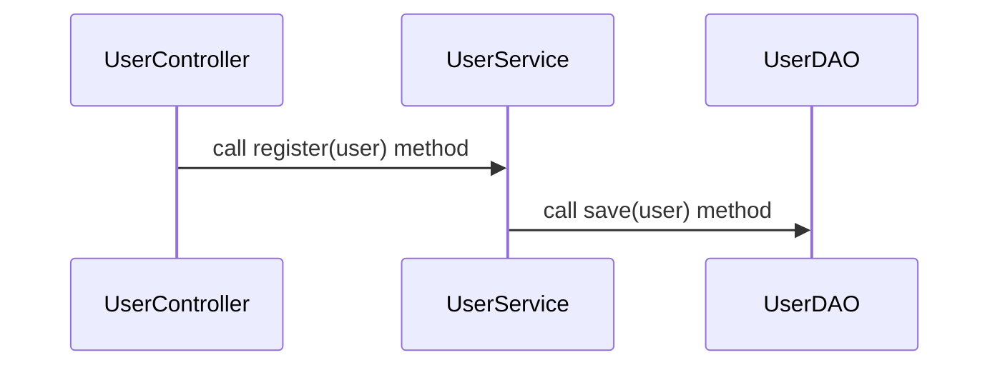
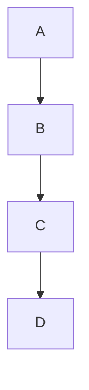

# diagrams-demo using mermaid-js

* https://mermaid-js.github.io/mermaid/#/flowchart

```mermaid
  graph TD;
  A-->B
  A-->C
  B-->D
  C-->D
```

##### Sequence Diagram

```mermaid
   sequenceDiagram
      participant UserController
      participant UserService
      participant UserDAO
      UserController->>UserService: call register(user) method
      UserService->>UserDAO: call save(user) method
```

##### Flow Chart

```mermaid
   flowchart TD;
   A-->B;
   B-->C;
   C-->D;
   click A callback "Valid"
   click B "http://www.github.com" "Invalid"
   click A call callback() "Valid"
   click B href "http://www.github.com" "Invalid"
```
